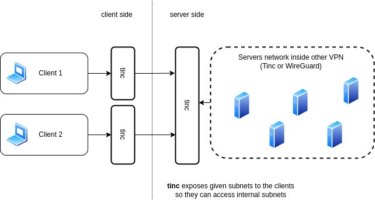

Tinc Gateway VPN
================

Purpose of this setup is to expose private subnets behind `Gateway node` to the `Client nodes`.

**Features:**
- Access to private subnets behind gateway
- Automatic client configuration generation
- Optional support for TOR (allows to hide administrator identity of a hidden service)
- Systemd support

TOR
---

